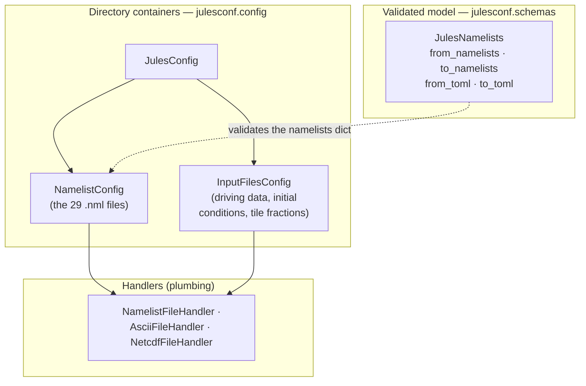

# The containers

julesconf has two layers you work with, plus a layer of plumbing you rarely
touch. Knowing which is which tells you what to reach for.

## `JulesNamelists` — the validated config model

This is the object you configure a run *through*. It holds the whole namelist
configuration as a typed, validated Pydantic model, and reads or writes it in
either [file form](file-forms.md) via its four peer methods
([`from_namelists`/`to_namelists`/`from_toml`/`to_toml`](../api/schemas/namelists.md)).
Validation — bounds, enums, and the cross-namelist list-length checks — happens
here.

`JulesNamelists` covers the **namelists only**. It does not touch input data; for
that you drop to the directory containers below.

Reach for it for almost everything: editing parameters, converting between
namelists and TOML, or validating a config.

## The directory containers — `julesconf.config`

These describe the **on-disk layout** of a JULES configuration and read/write it
as plain Python data (nested dicts and numpy arrays), without the typed schema in
between.

- **`NamelistConfig`** — the 29-file namelists directory. `read()` returns a
  nested dict; `write()` takes one back. This is the dict that
  `JulesNamelists.model_validate` consumes.
- **`InputFilesConfig`** — the input **data** directory: driving (meteorological
  forcing) data, initial conditions, and tile fractions. This is the *only* layer
  that handles input data — the typed model and TOML form deliberately do not.
- **`JulesConfig`** — the top level, combining a `NamelistConfig` and an
  `InputFilesConfig` so you can read or write a whole run directory in one call.

Reach for these when you need the raw directory data — especially input data
alongside the namelists. The
[Editing namelists directly](../tutorials/editing-namelists.md) tutorial works at
this layer.

## The handlers — plumbing

`NamelistFileHandler`, `AsciiFileHandler` and `NetcdfFileHandler` do the actual
file I/O for one file each, dispatched by extension (`.nml`, `.dat`/`.txt`/`.asc`,
`.nc`/`.cdf`). The directory containers delegate to them; you rarely name one
directly. They enforce a couple of safety rules — relative paths only, and
missing files handled gracefully — and are documented in the
[containers & handlers reference](../api/config.md).

## Which layer do I want?

| I want to… | Use |
|---|---|
| Edit parameters, validate, convert namelists ↔ TOML | `JulesNamelists` |
| Read/write the raw namelists dict | `NamelistConfig` |
| Read/write input data (driving, ICs, tile fractions) | `InputFilesConfig` |
| Read/write a whole run directory at once | `JulesConfig` |
| Do file I/O for a single file | a handler (rarely) |
