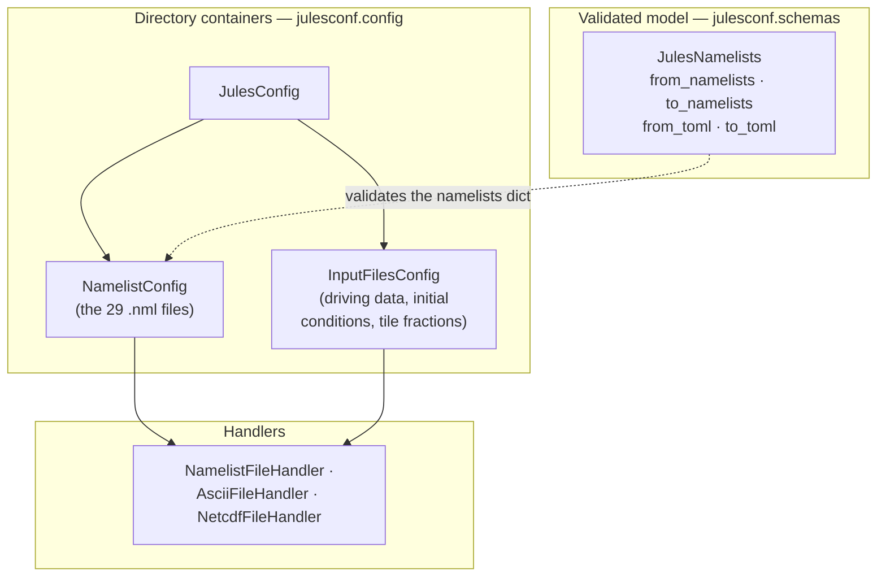

# Data files

A JULES run is namelists plus data: driving (meteorological forcing) data, initial conditions, and tile fractions.
`JulesNamelists` deliberately covers the namelists only.
It validates the *references* to data files that live in the namelists, but it never opens them.

Reading or writing the data alongside the config means dropping to the directory containers in `julesconf.config`, which describe an on-disk layout and move it as plain Python data — nested dicts, strings and numpy arrays — with no typed schema in between.

## The layers



| I want to | Use |
|---|---|
| Edit parameters, validate, convert namelists ↔ TOML | `JulesNamelists` |
| Read or write the raw namelists dict | `NamelistConfig` |
| Read or write input data | `InputFilesConfig` |
| Read or write a whole run directory at once | `JulesConfig` |
| Do file I/O for a single file | a handler, rarely |

## Describe the layout

Namelist paths are fixed in advance, so `NamelistConfig` needs no arguments.
Data file names vary per run, so you bind them at instantiation:

```python
from julesconf.config import InputFilesConfig, JulesConfig

jules_config = JulesConfig(
    inputs={
        "path": "inputs",
        "handler": lambda: InputFilesConfig(
            initial_conditions="initial_conditions.dat",
            tile_fractions="tile_fractions.dat",
            driving_data="Loobos_1997.dat",
        ),
    },
)
```

The object describes a layout; it does not hold any data yet.

## Read and write

```python
data = jules_config.read("examples/loobos")
jules_config.write("run", data)
```

`read` returns a nested dict with `namelists` and `inputs` keys.
The `namelists` half is exactly the dict `JulesNamelists.model_validate` consumes, so you can validate it without a second pass over the disk:

```python
from julesconf.schemas import JulesNamelists

config = JulesNamelists.model_validate(data["namelists"])
```

Handlers are dispatched by extension — `.nml`, `.dat`/`.txt`/`.asc` for ASCII, `.nc`/`.cdf` for NetCDF — so driving data may be either ASCII or NetCDF without you saying which.
Paths must be relative, and a missing file is handled rather than raising.
The [containers and handlers reference](../reference/api/config.md) has the details.

The [worked example](worked-example.md) does all of this against the Loobos configuration, including plotting the driving data it reads.

## Data files in a generated config

If you are writing many configs from one template, this split is usually what you want: the namelists change per run and the data does not.
Point every generated config at one shared data directory and write only the namelists per run.
[Generating configs](generating-configs.md) shows the pattern.
