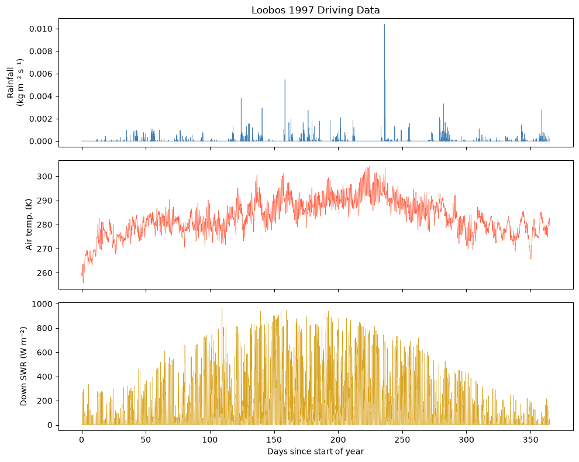

# Worked example: the Loobos configuration
<!---->
This notebook works at julesconf's container layer: reading a JULES configuration directory into plain Python data, editing it, and writing it back.
It is the layer that also carries the input data — driving data, initial conditions, tile fractions — alongside the namelists.

This is a first-class namelist workflow, not a legacy one.
If you mainly want to edit parameters or convert between namelists and TOML, the typed [`JulesNamelists`](namelists.md) model is the gentler route; come here when you need the raw directory data, especially the input data.

We will:

1. Construct a `JulesConfig` object with the right paths
2. Read an existing configuration from disk
3. Explore the configuration data
4. Tweak some parameters
5. Write the modified configuration back to disk

The example configuration we'll use is from the Loobos flux tower site, located in
`examples/loobos/`.

```python {.marimo}
import marimo as mo
```

```python {.marimo}
from julesconf.config import InputFilesConfig, JulesConfig
```

```python {.marimo}
from julesconf.schemas import JulesNamelists
```

## Constructing a JulesConfig

A `JulesConfig` object describes the layout of a JULES configuration directory.
It combines two sub-configurations:

- **`namelists`** — the directory of Fortran namelist files (all paths are fixed in advance)
- **`inputs`** — the directory of input data files (initial conditions, tile fractions, driving data)

The `namelists` node is already configured with default paths, so we only need to
specify the `inputs` node at instantiation:

````python {.marimo}
jules_config = JulesConfig(
    inputs={
        "path": "inputs",
        "handler": lambda: InputFilesConfig(
            initial_conditions="initial_conditions_bb219.dat",
            tile_fractions="tile_fractions.dat",
            driving_data="Loobos_1997.dat",
        ),
    },
)

mo.md(f"Configured:\n\n```\n{jules_config}\n```")
````

<!-- @output:Xref -->

Configured:

```
JulesConfig(inputs=Node(path=PosixPath('inputs'), handler=<function <lambda> at 0x7ddcb83f53a0>), namelists=Node(path=PosixPath('namelists'), handler=<class 'julesconf.config.NamelistConfig'>))
```

## Reading a configuration from disk

Now we use our `JulesConfig` to read the entire Loobos configuration directory into a Python dict.

```python {.marimo}
from pathlib import Path

loobos_dir = Path(__file__).resolve().parent / "loobos"

config_dict = jules_config.read(loobos_dir)

list(config_dict.keys())
```

<!-- @output:BYtC -->

<pre style="white-space: pre-wrap; overflow-wrap: break-word;">&#91;&#x27;inputs&#x27;, &#x27;namelists&#x27;&#93;</pre>

### Validating the configuration

Before exploring, validate the namelists against the JULES v7.9 Pydantic schemas.
This catches typos, out-of-range values, and cross-namelist inconsistencies.

```python {.marimo}
validated = JulesNamelists.model_validate(config_dict["namelists"])

mo.md(f"Validation passed — **{type(validated).__name__}** model created")
```

<!-- @output:Kclp -->

Validation passed — **JulesNamelists** model created

The top-level keys are `inputs` and `namelists`, matching the structure we defined.
Let's look inside the `drive` namelist, which controls the meteorological forcing setup:

```python {.marimo}
config_dict["namelists"]["drive"]
```

<!-- @output:Hstk -->

<pre style="white-space: pre-wrap; overflow-wrap: break-word;">{&#x27;jules_drive&#x27;: {&#x27;data_end&#x27;: &#x27;1997-12-31 23:00:00&#x27;,
                 &#x27;data_period&#x27;: 1800,
                 &#x27;data_start&#x27;: &#x27;1996-12-31 23:00:00&#x27;,
                 &#x27;diff_frac_const&#x27;: 0.4,
                 &#x27;file&#x27;: &#x27;inputs/Loobos_1997.dat&#x27;,
                 &#x27;interp&#x27;: &#91;&#x27;nf&#x27;, &#x27;nf&#x27;, &#x27;nf&#x27;, &#x27;nf&#x27;, &#x27;nf&#x27;, &#x27;nf&#x27;, &#x27;nf&#x27;, &#x27;nf&#x27;&#93;,
                 &#x27;nvars&#x27;: 8,
                 &#x27;t_for_con_rain&#x27;: 293.15,
                 &#x27;var&#x27;: &#91;&#x27;sw_down&#x27;,
                         &#x27;lw_down&#x27;,
                         &#x27;tot_rain&#x27;,
                         &#x27;tot_snow&#x27;,
                         &#x27;t&#x27;,
                         &#x27;wind&#x27;,
                         &#x27;pstar&#x27;,
                         &#x27;q&#x27;&#93;,
                 &#x27;z1_tq_in&#x27;: 10.0,
                 &#x27;z1_uv_in&#x27;: 10.0}}</pre>

### Exploring input data

The `inputs` section contains the actual numerical data. Here's the tile fractions file:

```python {.marimo}
tile_fractions_data = config_dict["inputs"]["tile_fractions"]

print("Comment header:")
print(tile_fractions_data["comment"])
print()
print("Values (shape:", tile_fractions_data["values"].shape, "):")
tile_fractions_data["values"]
```

<!-- @output:iLit -->

<pre style="white-space: pre-wrap; overflow-wrap: break-word;">Comment header:

Values (shape: (1, 9) ):
</pre>

<pre style="white-space: pre-wrap; overflow-wrap: break-word;">array(&#91;&#91;0.355, 0.355, 0.208, 0.   , 0.   , 0.   , 0.   , 0.082, 0.   &#93;&#93;)</pre>

```python {.marimo}
import matplotlib.pyplot as plt
import numpy as np
```

### Plotting the driving data

Let's verify the driving data loaded correctly by plotting a few key variables
over the year. The Loobos 1997 dataset contains 30-minute meteorological readings.

```python {.marimo}
driving_data = config_dict["inputs"]["driving_data"]
driving_values = driving_data["values"]

num_timesteps = driving_values.shape[0]
half_hour_intervals = np.arange(num_timesteps) / 48.0  # convert to days

fig_101, axes_101 = plt.subplots(3, 1, figsize=(10, 8), sharex=True)

axes_101[0].plot(
    half_hour_intervals, driving_values[:, 2], color="steelblue", linewidth=0.5
)
axes_101[0].set_ylabel("Rainfall\n(kg m⁻² s⁻¹)")
axes_101[0].set_title("Loobos 1997 Driving Data")

axes_101[1].plot(
    half_hour_intervals, driving_values[:, 4], color="tomato", linewidth=0.5
)
axes_101[1].set_ylabel("Air temp. (K)")

axes_101[2].plot(
    half_hour_intervals, driving_values[:, 0], color="goldenrod", linewidth=0.5
)
axes_101[2].set_ylabel("Down SWR (W m⁻²)")
axes_101[2].set_xlabel("Days since start of year")

fig_101.tight_layout()
mo.mpl.interactive(fig_101)
```

<!-- @output:qnkX -->



The seasonal patterns are clearly visible — rainfall events, temperature cycles,
and solar radiation all look as expected for a full year of half-hourly data.
<!---->
## Modifying parameters

Let's try two modifications to `timestep_len`: first an invalid value that
breaks the schema, then a valid one.

```python {.marimo}
original_timestep_len = config_dict["namelists"]["timesteps"]["jules_time"][
    "timestep_len"
]

mo.md(f"Current `timestep_len`: **{original_timestep_len}** seconds")
```

<!-- @output:DnEU -->

Current `timestep_len`: **1800** seconds

### Trying an invalid modification

What happens if we set `timestep_len` to 0 seconds?
The schema requires it to be ≥ 1, so validation will raise.

```python {.marimo}
config_dict["namelists"]["timesteps"]["jules_time"]["timestep_len"] = 0
JulesNamelists.model_validate(config_dict["namelists"])
```

<!-- @output:ecfG -->

<pre class="stderr" style="white-space: pre-wrap; overflow-wrap: break-word;">Traceback (most recent call last):
  File &quot;/tmp/marimo_88748/__marimo__cell_ecfG_.py&quot;, line 2, in 
    JulesNamelists.model_validate(config_dict&#91;&quot;namelists&quot;&#93;)
  File &quot;/home/joe/github.com/NERC-CEH/julesconf/.venv/lib/python3.12/site-packages/pydantic/main.py&quot;, line 732, in model_validate
    return cls.__pydantic_validator__.validate_python(
           ^^^^^^^^^^^^^^^^^^^^^^^^^^^^^^^^^^^^^^^^^^^
pydantic_core._pydantic_core.ValidationError: 1 validation error for JulesNamelists
timesteps.jules_time.timestep_len
  Input should be greater than or equal to 1 &#91;type=greater_than_equal, input_value=0, input_type=int&#93;
    For further information visit https://errors.pydantic.dev/2.13/v/greater_than_equal

</pre>

<pre style="white-space: pre-wrap; overflow-wrap: break-word;">exception: 1 validation error for JulesNamelists
timesteps.jules_time.timestep_len
  Input should be greater than or equal to 1 &#91;type=greater_than_equal, input_value=0, input_type=int&#93;
    For further information visit https://errors.pydantic.dev/2.13/v/greater_than_equal</pre>

### Making a valid modification

Now let's set `timestep_len` to `3600` seconds (hourly output).

```python {.marimo}
config_dict["namelists"]["timesteps"]["jules_time"]["timestep_len"] = 3600
```

```python {.marimo}
JulesNamelists.model_validate(config_dict["namelists"])

mo.md("Validation passed")
```

<!-- @output:aLJB -->

Validation passed

## Writing the modified configuration to disk

Finally, we write the updated configuration to a temporary directory.
In practice you would use a persistent output directory.

```python {.marimo}
import tempfile

with tempfile.TemporaryDirectory() as output_dir_101:
    jules_config.write(output_dir_101, config_dict)

    mo.md(
        f"Configuration written to `{output_dir_101}`\n\n"
        f"Verified: `output.nml` exists with updated `output_period = 3600`"
    )
```

## Next steps

You've now seen the core workflow:

1. **Construct** a `JulesConfig` with paths to your namelist and input files
2. **Read** an existing configuration directory into a Python dict
3. **Explore** and modify the configuration data
4. **Write** the configuration back to disk

From here:

- [Data files](data-files.md) — how this layer relates to the typed `JulesNamelists` model.
- [Working with TOML](toml.md) — the terser single-file form.
- [Generating configs](generating-configs.md) — the same idea, many runs at a time.
- [Containers and handlers](../reference/api/config.md) — `JulesConfig`, `InputFilesConfig`, and the ASCII/NetCDF handlers in detail.